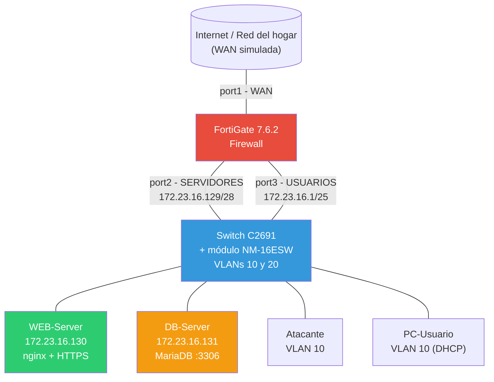
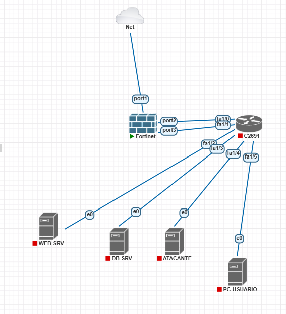
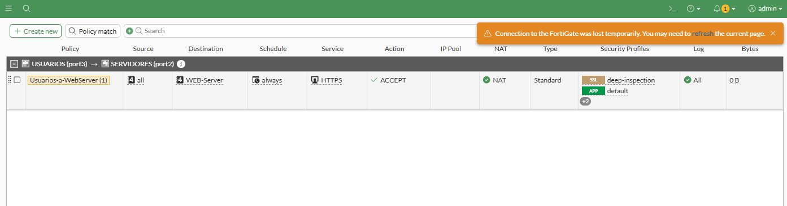
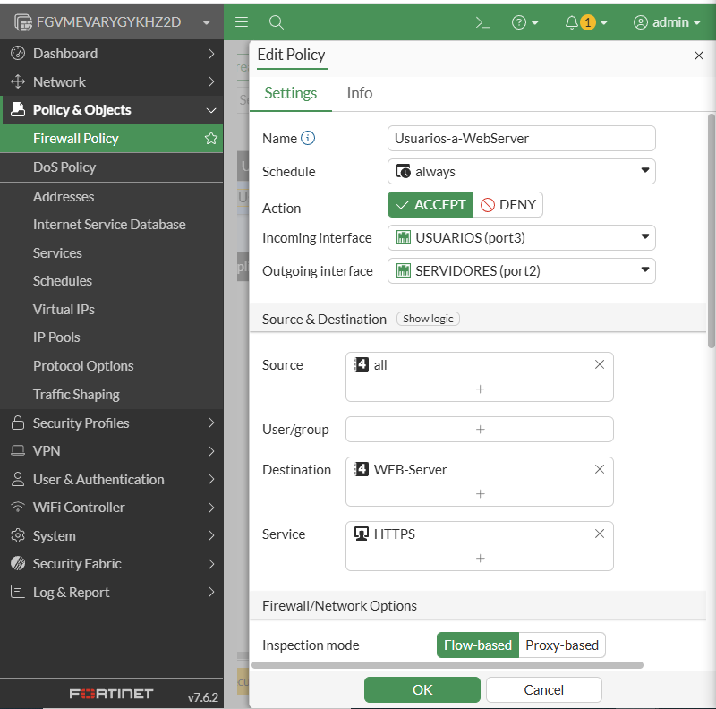
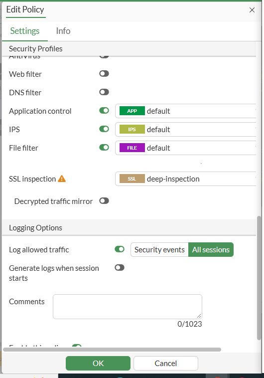
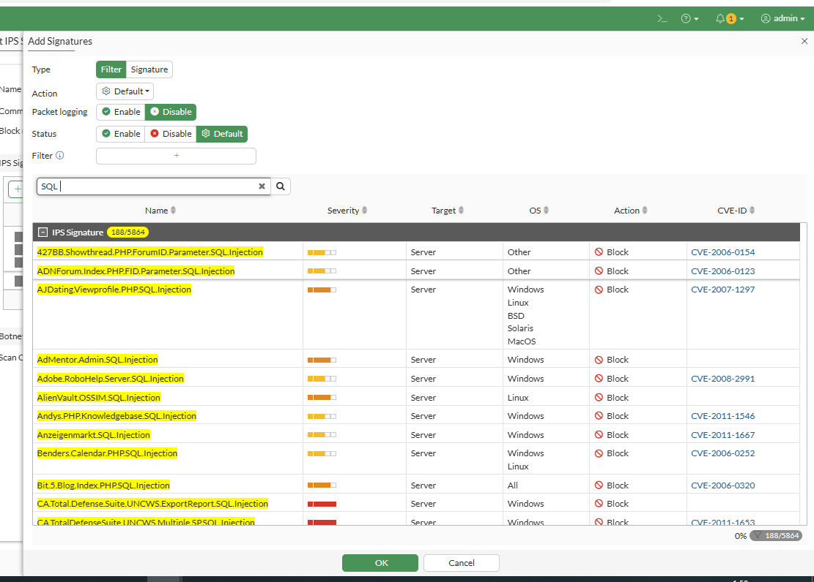
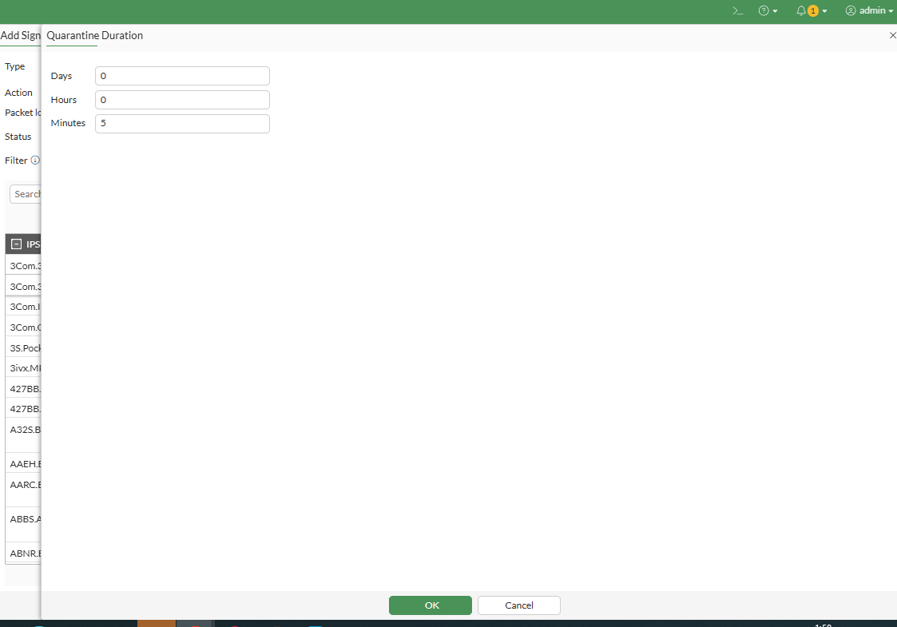
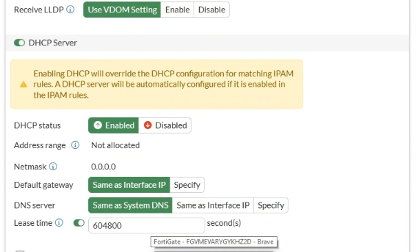
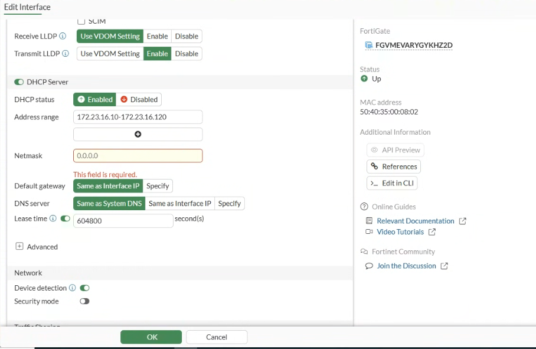

# Laboratorio de Seguridad de Redes con FortiGate

**Estudiante:** Abdul Djalo
**Matrícula:** 2023-1600
**Video demostrativo:** [https://youtu.be/8OJFLaAji00?si=_ybOGAcOTtPicGl4] ⬅️ *Reemplazar con el link de YouTube/OneDrive*

---

## 🎥 Video demostrativo

> (https://youtu.be/8OJFLaAji00)

---

## Propósito del laboratorio

Este laboratorio tiene como objetivo implementar y demostrar una topología de red segmentada y protegida mediante un firewall de nueva generación **FortiGate**, aplicando controles de seguridad de red en múltiples capas: filtrado de tráfico entre segmentos, inspección profunda de paquetes (DPI), detección y bloqueo de intentos de inyección SQL con cuarentena automática del atacante, control de aplicaciones para bloquear descargas de archivos ejecutables, protección contra denegación de servicio (DoS), y segmentación de red mediante VLANs con seguridad básica a nivel de switch.

El direccionamiento IP utilizado se basa en la matrícula del estudiante (2023-1600), usando los octetos **23** y **16** derivados de la matrícula para construir la red `172.23.16.0/24`.

---

## Diagrama de topología





---

## Direccionamiento IP (basado en matrícula 2023-1600)

| Segmento | Red | Rango útil |
|---|---|---|
| Servidores (WEB + DB) | `172.23.16.128/28` | .129 - .142 |
| WEB-Server | `172.23.16.130/28` | — |
| DB-Server | `172.23.16.131/28` | — |
| Usuarios (VLAN 10) | `172.23.16.0/25` | .1 - .126 |
| Pool DHCP Usuarios | — | `172.23.16.10 - 172.23.16.120` |
| WAN (Internet/Management) | DHCP dinámica de la red bridged | — |

---

## 1. Configuración del FortiGate (100% por GUI)

### 1.1 Interfaces

Se configuraron 3 interfaces físicas: WAN (port1, DHCP), SERVIDORES (port2, `172.23.16.129/28`) y USUARIOS (port3, `172.23.16.1/25`).


### 1.2 Ruta por defecto

Se configuró una ruta estática `0.0.0.0/0` saliendo por la interfaz WAN hacia el gateway de la red del hogar.


### 1.3 Políticas de Firewall

Se implementaron 3 políticas de firewall (dentro del límite de la licencia de evaluación):

1. **Usuarios → WEB-Server (443):** ACCEPT, con NAT, DPI (SSL deep-inspection), IPS, Application Control y File Filter activados.
2. **Bloqueo Usuarios → DB-Server:** DENY explícito (además del *implicit deny* que ya aplica por estar en interfaces distintas).
3. **Servidores → Internet:** ACCEPT con NAT (necesaria para actualizar/instalar paquetes en los servidores).




### 1.4 Perfiles de seguridad (DPI, IPS, App Control, File Filter)

Sobre la política principal se activaron:
- **DPI / SSL Inspection:** modo `deep-inspection`, descifrando el tráfico HTTPS para poder inspeccionar el contenido real.
- **IPS (Intrusion Prevention System):** perfil personalizado con un filtro de **188 firmas de SQL Injection** (búsqueda por patrón `SQL` sobre la base de firmas de FortiGuard), configurado con acción **Block** y **Quarantine** (60 minutos) para el atacante.
- **Application Control:** activado sobre la política.
- **File Filter:** configurado para bloquear descargas de archivos `.exe` sobre HTTP/HTTPS.





### 1.5 DoS Policy (Rate Limiting)

Se creó una política DoS (`Anti-DoS-WebServer`) sobre la interfaz USUARIOS, con protección contra `tcp_syn_flood` y anomalías L3/L4, con umbrales bajos para detección temprana de ataques de denegación de servicio.

### 1.6 DHCP para Usuarios (VLAN10)

Se configuró un servidor DHCP en la interfaz USUARIOS con rango `172.23.16.10 - 172.23.16.120`.




---

## 2. Configuración del Switch (Cisco C2691 + módulo NM-16ESW)

- **VLAN 10** (USUARIOS) y **VLAN 20** (SERVIDORES) creadas mediante `vlan database`.
- Puertos de acceso asignados a cada VLAN correspondiente.
- **Seguridad básica de red:** `spanning-tree portfast` en los puertos de acceso, y **todos los puertos sin uso deshabilitados** (`shutdown`) en el rango fa1/6-1/15.
- *Nota técnica:* se identificó que el módulo NM-16ESW emulado en este entorno **no soporta** `switchport port-security` ni ACLs de IP en dirección `out` sobre puertos de switch (limitaciones documentadas del hardware/IOS emulado). Como alternativa, la restricción de que **WEB-Server solo puede comunicarse con DB-Server en el puerto 3306** se implementó exitosamente mediante **firewall local (iptables) directamente en el DB-Server**, una práctica de seguridad de "defensa en profundidad" a nivel de host, verificada y funcional.

Ver el archivo `running-configs/switch-c2691.txt` para la configuración completa.

---

## 3. Servidores

### WEB-Server (172.23.16.130)
- Alpine Linux + **nginx** configurado con **HTTPS** (puerto 443) y certificado autofirmado.

### DB-Server (172.23.16.131)
- Alpine Linux + **MariaDB** escuchando en el puerto 3306.
- **iptables** configurado para aceptar conexiones al puerto 3306 **únicamente** desde la IP de WEB-Server (172.23.16.130), bloqueando cualquier otro origen — verificado exitosamente durante las pruebas (ver video).

---

## 4. Pruebas de seguridad realizadas

- ✅ Usuarios pueden acceder a WEB-Server por HTTPS (443).
- ✅ Usuarios **no pueden** acceder a DB-Server (3306) — bloqueado por política de firewall.
- ✅ WEB-Server **sí puede** conectarse a DB-Server en el puerto 3306 (verificado con cliente MySQL).
- ✅ Inyección de payload SQL Injection desde el nodo Atacante hacia WEB-Server, bloqueado y registrado por el perfil IPS (ver video y logs de Security Events).
- ✅ Filtro de archivos `.exe` activo sobre tráfico web.
- ✅ Política DoS activa para mitigar ataques de inundación.

---

## Estructura del repositorio

```
/
├── README.md                  (este archivo)
├── imagenes/                  (capturas de pantalla de toda la configuración)
├── running-configs/           (configuraciones exportadas del FortiGate y el switch)
└── scripts/                   (comandos y scripts usados: red, iptables, nginx, mariadb)
```
